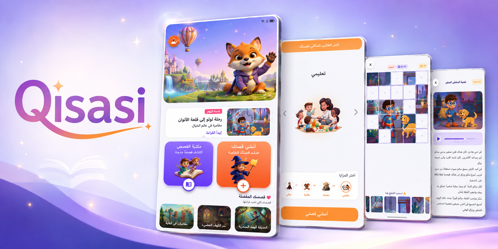
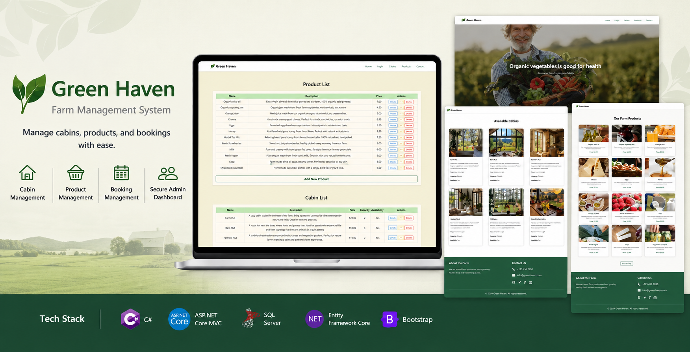
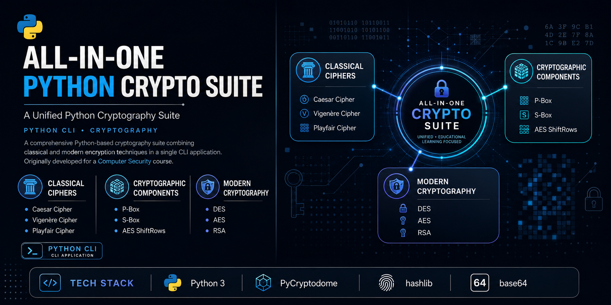
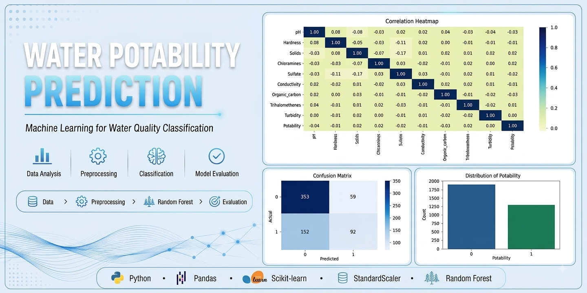
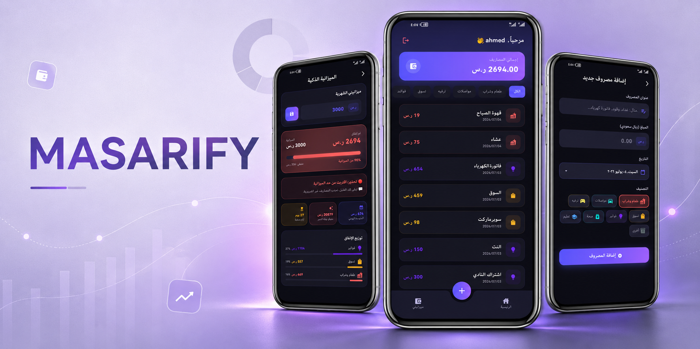

  <!-- Header Typing Banner -->
  

  <!-- Badges Sub-header -->
  

    
    
    
  

  

    Crafting intelligent, scalable, and impact-driven software solutions across <b>Mobile, Web, Desktop, & Data Science</b>.
  

 

## 🧑‍💻 What I Build

* 📱 **Mobile Applications** — Cross-platform experiences with `Flutter`
* 🌐 **Web Applications** — Scalable web systems with `ASP.NET Core MVC` & `Angular`
* 🖥️ **Desktop Applications** — Desktop solutions built with `C#` & `Windows Forms`
* 🤖 **AI & Data Solutions** — Predictive models with `Machine Learning` & `Rule-Based Systems`
* 🗄️ **Database Architectures** — Relational schemas using `SQL Server` & `SQLite`

 

## 🛠️ Tech Stack

**Languages**  

  
  
  
  
  
  
  
  

**Frameworks & Technologies**  

  
  
  
  
  
  

**Databases**  

  
  

**Core Concepts**  
`Machine Learning` · `Data Analytics` · `REST APIs` · `Cryptography` · `Rule-Based Systems` · `OOP` · `Data Structures & Algorithms` · `Database Design`

 

---

# 🚀 Featured Projects

### 01 · Qisasi
> **An interactive children's story app with rule-based story recommendations, built with Flutter and SQLite.**

 

### 02 · Green Haven
> **A tourism farm management system built with ASP.NET Core MVC and Entity Framework Core.**

 

### 03 · All-in-One Python Crypto Suite
> **A unified Python toolkit implementing and exploring practical cryptographic techniques.**

 

### 04 · Water Potability Prediction
> **A machine learning project for predicting water potability from water quality features.**

 

### 05 · Masarify
> **An offline personal expense manager with budgeting, spending analytics, and financial insights.**

 

---

# 📦 Other Projects

* 📋 **[Mahami](https://github.com/RzanBash/MahamiTaskManager)** — A bilingual Flutter task manager with local storage, state management, and scheduled reminders.  
  `Flutter` `Provider` `SharedPreferences` `Local Notifications`

* 🌤️ **[Weather App](https://github.com/RzanBash/Flutter-WeatherApp-GetX)** — A Flutter weather application integrating REST APIs with reactive state management using GetX.  
  `Flutter` `GetX` `REST API` `WeatherAPI`

* 🌸 **[WinFormsStoreManager](https://github.com/RzanBash/WinFormsStoreManager)** — A C# Windows Forms application for managing products, cashiers, authentication, and store sales.  
  `C#` `Windows Forms` `SQL Server`

 

---

# 🎓 Education & Continuous Learning

* 🎓 **B.Sc. in Computer Science** — 🏛️ *Hadhramout University*
* 🔹 **McKinsey.org Forward Program** — *McKinsey & Company*
* 🔹 **Microsoft Azure AI Fundamentals** — *Women Elevate Program*
* 🔹 **Artificial Intelligence Fundamentals with Capstone Project** — *IBM SkillsBuild*

 

  <h3>Let's Connect</h3>
  
I'm always interested in learning, building, and exploring new ideas.

  
  
  

    

  ✨ <b>Thanks for visiting my profile! 👋</b> ✨

